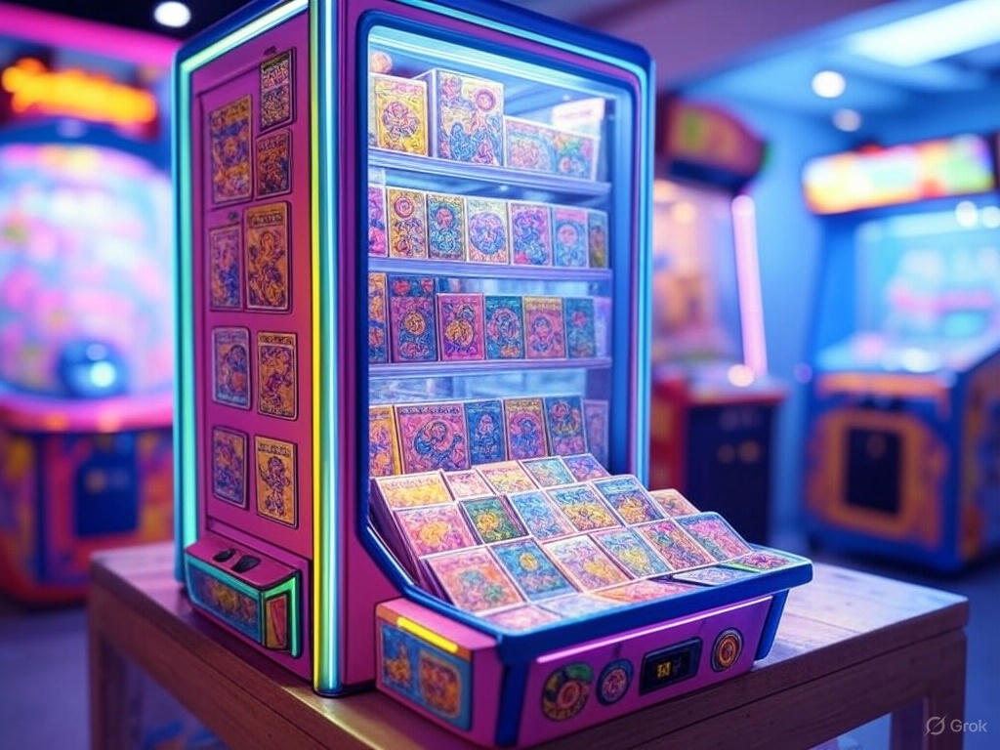
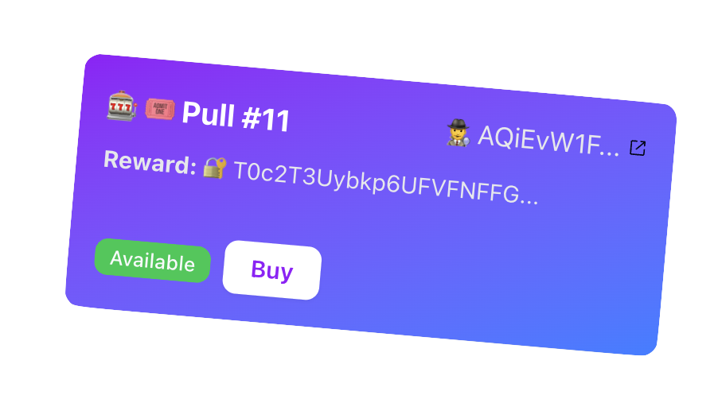

# Gacha-Sol: Spin the Capsule on Solana!

<div class="text-center mt-8">
  <p class="text-xl text-neutral-300 mt-4">A Decentralized Gacha Game with Confidential Transfers</p>
  <p class="text-sm text-neutral-400">Presented by pupplecat | Solana Enthusiast | May 16, 2025</p>
</div>

<div class="abs-br m-6">
  
</div>

---
layout: center
title: The Challenge of Privacy in Gaming
transition: slide-up
---

# The Challenge of Privacy in Gaming

- Traditional gacha games expose reward values, risking user trust.
- Decentralized games need secure, private reward distribution.
- Solana’s confidential transfers offer a solution, but are underutilized.

<div class="mt-4">
  
</div>

---
layout: default
title: "Gacha-Sol: How It Works"
transition: slide-up
---

# Gacha-Sol: How It Works

- **Users buy pulls** with public tokens (e.g., USDC).
- **Authority verifies** vault balance with zero-ciphertext proofs.
- **Rewards are withdrawn** confidentially and transferred to users.

## Tech Stack
- Solana, Anchor 0.31.1, SPL Token 2022, Rust
- Next.js, Tailwind CSS for UI

**Unique Feature**: Hybrid CT approach (confidential deposit + public flow)

---
layout: two-cols-header
title: Under the Hood
transition: slide-up
---

# Under the Hood

::left::

- **Smart Contract**:
  - Instructions: `buy_pull`, `open_pull`
  - State: `Pull`, `GameConfig`
- **UI**:
  - Home, Pull List (grid, pagination), Pull Card (modal)
- **Challenges**:
  - Managed transaction size (e.g., 2574 bytes)
  - Handling encryption keys
- **Testing**: Rust tests with `cargo test`, devnet deployment

::right::

## Code Snippet: `buy_pull`

```rust
pub fn buy_pull(ctx: Context<BuyPull>, params: BuyPullParams)
  -> Result<()> {
    let pull = &mut ctx.accounts.pull;
    pull.buyer = *ctx.accounts.buyer.key;
    // ... (token transfer logic)
    Ok(())
}
```

---
layout: image-right
title: "Live Demo: Spin the Capsule!"
image: /assets/ui-screenshot.png
transition: slide-up
---

# Live Demo: Spin the Capsule!

1. **Connect Wallet & Get Tokens**: https://faucet.circle.com/
2. **Browse Pulls**: Show page 3 of 4, filter options
3. **Buy a Pull**: Trigger confirmation modal, complete purchase
4. **Open Pull**: Reveal reward (e.g., Pull #8)

- **Website**: https://gacha-sol-app.vercel.app/
- **Contract**: `GaChaWso1g5y2Rby6pwLSRxezyoxtbaMDyb5sqwYvNGq`

---
layout: default
title: Achievements and Future
transition: slide-up
---

# Achievements and Future

- **Achievements**:
  - Supports unlimited pulls using PDAs, with successful devnet transactions
  - Polished UI with animations and privacy features
  - Confidentially verifies reward vault balance using zero-ciphertext proofs
- **Potential**:
  - Scale to a full game
  - Inspire privacy-focused dApps
- **Future Work**:
  - Enhancement for user-initiated open pull
  - Mainnet deployment



---
layout: center
title: Wrap-Up & Questions
transition: slide-up
---

# Wrap-Up & Questions

- **Summary**: Gacha-Sol blends fun and privacy on Solana!
- **Call to Action**: Open-source under MIT License, feedback welcome
- **Q&A Invite**: Any questions? I’m happy to dive deeper!

<div class="mt-6 text-center">
  <span class="text-gray-600">Thank you for watching!</span>
</div>